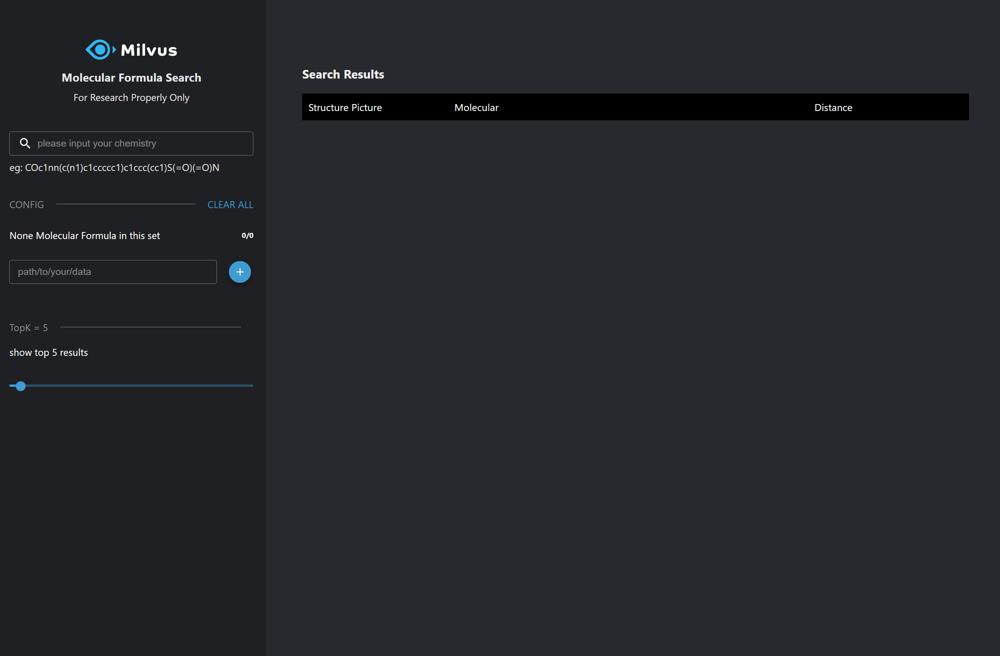

# Molecular Similarity Search

## Environment

| Component     | Recommended Configuration                                                     |
| -------- | ------------------------------------------------------------ |
| CPU      | Intel(R) Core(TM) i7-7700K CPU @ 4.20GHz                     |
| Memory   | 32 GB                                                         |
| OS       | Ubuntu 18.04                                                 |
| Software | [Milvus 1.0](https://milvus.io/docs/v1.0.0/overview.md) <br />mols-search-webserver 0.7.0 <br />mols-search-webclient 0.3.0 |

The previous configuration has been tested and this scenario is also supported in Windows.

## Data preparation

Data source: [ftp://ftp.ncbi.nlm.nih.gov/pubchem/Compound/CURRENT-Full/SDF](ftp://ftp.ncbi.nlm.nih.gov/pubchem/Compound/CURRENT-Full/SDF). The data source contains compressed SDF files. You need to convert these files to SMILES files. We already prepared a SMILE file containing 10,000 chemical structures [test_1w.smi](../../solutions/mols_search/smiles-data). You can use wget to download the file:

```bash
$ wget https://raw.githubusercontent.com/milvus-io/bootcamp/0.10.0/solutions/mols_search/smiles-data/test_1w.smi
```

## Deploy

#### 1. Run Milvus Docker

This demo uses Milvus 1.0 CPU version. Refer to [milvus.io](https://milvus.io/docs/milvus_docker-cpu.md) to learn how to install and run Milvus. 

#### 2. Run mols-search-webserver docker

```bash
$ docker run -d -v <DATAPATH>:/tmp/data -p 35001:5000 -e "MILVUS_HOST=192.168.1.25" -e "MILVUS_PORT=19530" milvusbootcamp/mols-search-webserver:0.7.0
```

Refer to the following table for the parameter description:

| Parameter                     | Description                                                      |
| ----------------------------- | ------------------------------------------------------------ |
| -v DATAPATH:/tmp/data       | -v specifies directory mapping between the host and the docker image. Please modify `/tmp/data` to your path of test_1w.smi. |
| -p 35001:5000                 | -p specifies pot mapping between the host and the image.                        |
| -e "MILVUS_HOST=192.168.1.25" | -e specifies the system parameter mapping between the host and the image. Pease modify `192.168.1.25` to the IP address of the Milvus docker.|
| -e "MILVUS_PORT=19530"        | Pease modify `19530` to the port of Milvus docker.           |

#### 3. Run mols-search-webclient docker

```bash
$ docker run -d -p 8001:80 -e API_URL=http://192.168.1.25:35001 milvusbootcamp/mols-search-webclient:0.3.0
```

> Note: Please modify `192.168.1.25` to the IP address of the Milvus docker.

#### 4. Launch a browser

```bash
# Please modify IP address and port according the previous configurations
http://192.168.1.25:8001
```

## How to use

- Initial interface



- Load chemical structures
  1. In `path/to/your/data`, enter the location of the smi file. For example, `/tmp/data/test_1w.smi`.
  2. Click `+` to load.
  3. You can see the number of chemical structures have changed: 10000 Molecular Formula in this set


- Search chemical structures
  1. Enter the chemical structure to search, such as `Cc1ccc(cc1)S(=O)(=O)N`, and press \<ENTER\>.
  2. Set the value of topk. This demo returns topk most similar chemical structures.


- Clear chemical structure data

  Click `CLEAR ALL` to remove all chemical structure data.


## Conclusion

This demo shows a system about molecular similarity search with Milvus. You can also use your own SMILES data.

We have built the demo system (https://milvus.io/scenarios), and we also have an open source projects on substructure and superstructure search in called [MolSearch](https://github.com/zilliztech/MolSearch), so you are welcome to try it yourself and search your own molecular.
